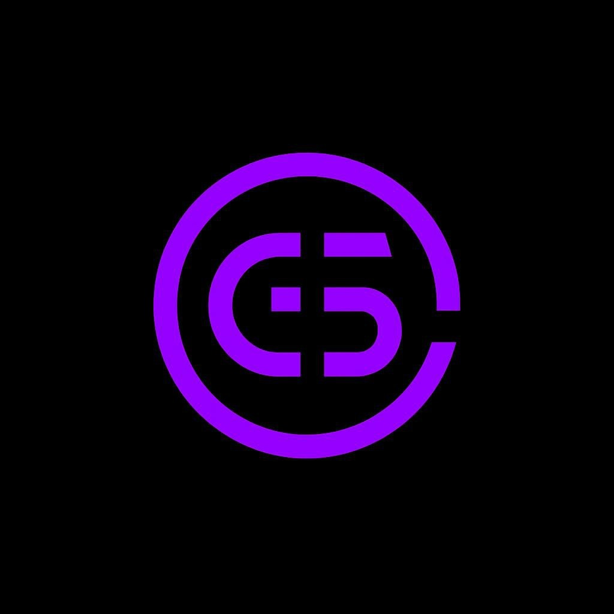

# Muhamad Galih Saputra

**Principal Architect @ [GalyarderLabs](https://galyarderlabs.app)**

Fullstack. Web3. AI Systems. Infrastructure.
 

---

### Philosophy

Autonomous Agents and Sovereign Systems are the final frontier of financial sovereignty. **Systematic alpha. Economic leverage. Operational freedom.**

*No validation required. Only efficiency.*

Production systems where failure is not an option. Financial infrastructure, autonomous AI agents, smart contracts, cryptographic integrity—where a bug costs money and a vulnerability costs everything.

**Data over opinion.** Every claim requires evidence. Logs, traces, metrics, tests. If it's not in the log, it didn't happen.

**Security by default.** Input is hostile until validated. Output is dangerous until sanitized. Trust boundaries exist for a reason.

**Fail fast, fail loud.** Silent failures are production nightmares. Errors surface with context—what failed, why, and how to fix it.

---

### Operational Focus

- **Self-sustaining economic engines** — operators own their systems. Control their cashflow.
- **Proprietary protocols** — raw market data and operational chaos transformed into actionable, high-value signal.
- **Autonomous AI agents** — complex strategies executed 24/7. Manual labor replaced.

---

### Stack

