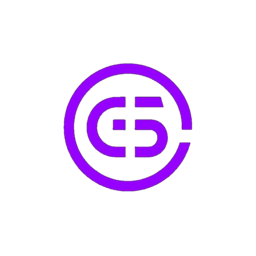

# Muhamad Galih Saputra

**Lead Architect @ [Galyarder Labs](https://hub.galyarderlabs.app)**

Autonomous AI Systems | Web3 Infrastructure | Scalable Execution
 

---

### Engineering Philosophy

The market does not reward effort; it rewards leverage. While most rely on manual execution and generic tools, I architect systems that operate 24/7 without fatigue.

**Code is the only truth.** Manual research is a liability. If a workflow requires daily human input, the system is fundamentally flawed.

**Sovereignty by default.** Capital and data must reside on decentralized, non-custodial infrastructure. Value is mathematically owned, not rented.

**Production Integrity.** Security is not an option. I build in environments where execution must be low-latency, a vulnerability costs capital, and failures are immediately logged and sanitized.

---

### Operational Focus

- **The Brain (AI Agents)** — cloning human decision patterns into specialized code. Manual labor replaced.
- **The Rails (Web3)** — self-sustaining economic engines, smart contracts, and cryptographic integrity.
- **The Loop (Data)** — raw market data and operational chaos transformed into automated, high-value signals.

---

### Stack

---

   Empowering Human Intent.

